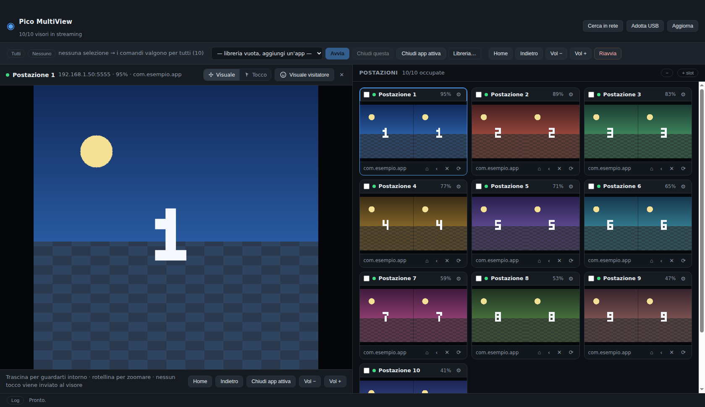
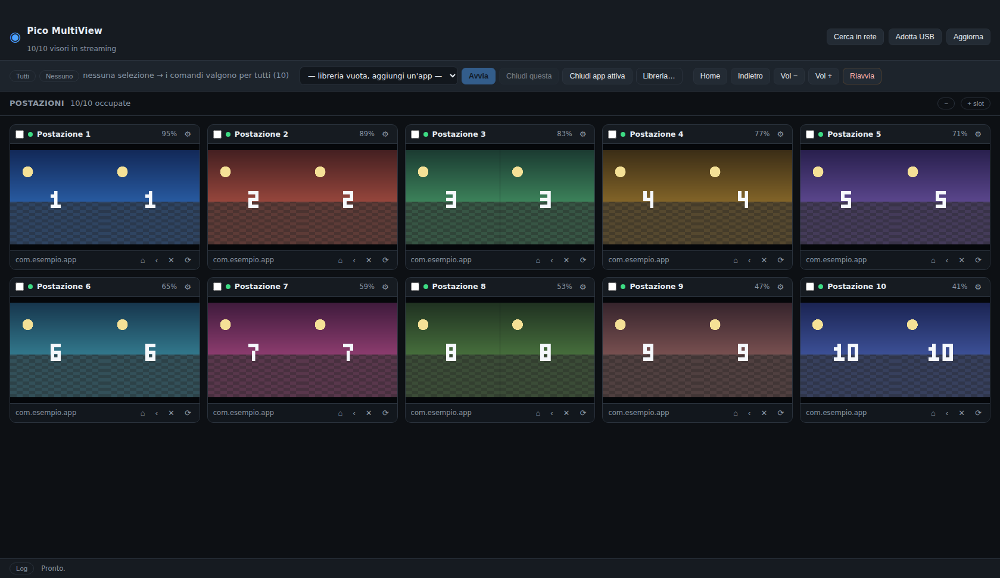
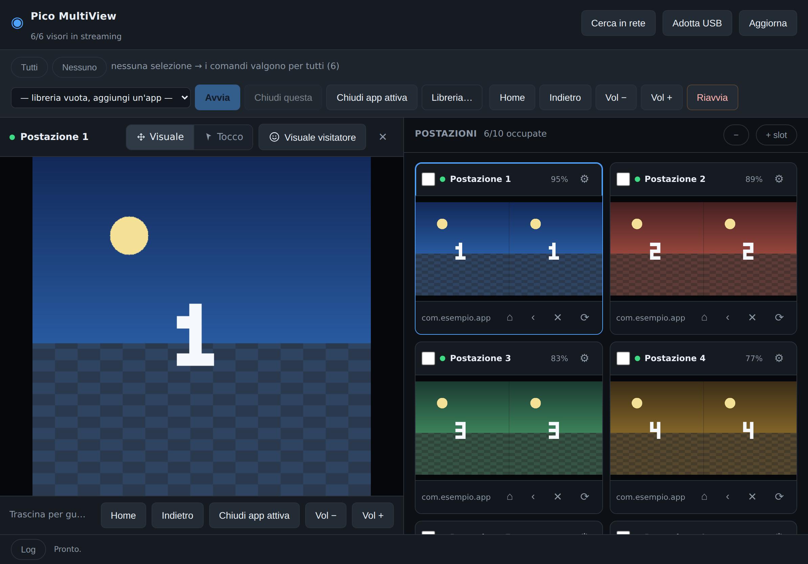

# Pico MultiView

Regia da Mac per una flotta di **PICO 4**: dieci postazioni da riempire, l'anteprima grande del
visore selezionato su metà schermo e le miniature di tutti gli altri sull'altra metà, così non
perdi mai di vista la sala.

Nato per gli eventi: dieci visori in mano al pubblico, una persona che li governa da un
portatile senza toglierli dalla testa a nessuno.



## Come è fatta

**Schermata principale — le postazioni.** Dieci slot vuoti (puoi aggiungerne o toglierne).
Clicchi uno slot e scegli come riempirlo: cerca i visori in rete, prendi quello collegato via
USB, oppure inserisci l'IP a mano. Ogni postazione resta associata al suo visore anche dopo
aver chiuso l'app, così la disposizione dell'evento non si perde.



**Clicchi un visore → si apre l'anteprima.** Lo schermo si divide: a sinistra il visore grande
e a più risoluzione, a destra le miniature di tutti gli altri, sempre vive. Ogni miniatura resta
cliccabile: passi da un visore all'altro con un clic.

**Visuale libera.** Nell'anteprima, tieni premuto il tasto sinistro e muovi il mouse per
spostarti dentro l'immagine del visore; la rotellina zooma. In questa modalità **non viene
inviato nessun tocco al visore**: puoi guardare in giro mentre il visitatore sta usando l'app,
senza disturbarlo.

**Il pulsante con la faccia** 🙂 riporta l'inquadratura esattamente su quello che sta guardando
chi indossa il visore. Si accende da solo quando ti sei spostato, così sai sempre se stai
guardando la visuale del visitatore o una tua. Scorciatoia da tastiera: `0`.

**Modalità Tocco.** Il segmento `Tocco` nella barra dell'anteprima trasforma il mouse in un dito:
clic e trascinamenti diventano tocchi veri sullo schermo del visore, la rotellina scorre, il
tasto destro fa "indietro". Si riparte sempre da `Visuale` quando cambi visore: durante un evento
non vuoi cliccare per sbaglio nel visore di un visitatore.

**Comandi di gruppo.** Avvia un'app, chiudi quella in primo piano, torna alla home, volume,
riavvio: su una selezione (le caselle sulle miniature) o su tutte le postazioni.

**Telecomando da iPad.** Il Mac può servire la stessa identica interfaccia sulla wifi: apri Safari
sull'iPad e ti ritrovi postazioni, anteprima e comandi, con i gesti al posto del mouse — un dito
per guardarti intorno, due dita per zoomare. Vedi *[Comandare tutto dall'iPad](#comandare-tutto-dalliPad)*.

### Fin dove arriva la visuale libera — e dove no

Lo stream contiene **solo quello che il visore sta disegnando**, cioè il campo visivo di chi lo
indossa. La visuale libera si muove dentro quel fotogramma: siccome la cattura di un PICO 4 è
stereoscopica (i due occhi affiancati, 2:1), l'app mostra di default **l'occhio sinistro** — la
visuale del visitatore — e trascinando puoi arrivare fino all'altro occhio o zoomare sui
dettagli. Non puoi però girarti a guardare dietro le spalle del visitatore: quei pixel non
esistono nello stream.

Per un vero sguardo indipendente a 360° servirebbe una seconda telecamera **dentro** l'app VR
(un piccolo componente Unity/Unreal che pubblica una view di regia). Se l'esperienza dell'evento
è vostra, è la strada giusta: questa app è già pronta a mostrarne il flusso.

Nelle **app immersive** vale lo stesso discorso per il tocco: l'app ascolta i controller, non il
touchscreen, quindi il clic può non produrre nulla. Restano sempre validi i comandi di sistema
(Home, Indietro, Chiudi app attiva, avvio app, volume) e, in modalità Tocco, i tasti freccia +
Invio che diventano eventi DPAD. Sui **pannelli 2D** — home di PICO, menu di sistema, browser,
app 2D — il puntatore funziona invece molto bene.

---

## Comandare tutto dall'iPad



L'iPad non può parlare direttamente ai visori: `adb` non esiste su iPadOS. Ma non serve — il Mac
fa già tutto il lavoro e può servire la stessa interfaccia sulla rete locale. L'iPad diventa il
telecomando che ti porti in giro per la sala.

1. Sul Mac: **Telecomando…** nella barra in alto → **Accendi**.
2. Compaiono l'indirizzo (uno per ogni rete a cui il Mac è collegato) e un PIN di sei caratteri.
3. Sull'iPad apri Safari e digita l'indirizzo con il PIN già dentro, per esempio
   `http://192.168.1.10:8788/?k=K7M2Q4`: entri diretto. In alternativa vai a
   `http://192.168.1.10:8788` e inserisci il PIN nel modulo.
4. Per averlo come un'app: **Condividi → Aggiungi a Home**. Parte a tutto schermo, senza barre.

Funziona uguale da iPhone o da un secondo portatile: è una normale pagina web.

**I gesti.** Un dito trascina l'inquadratura, due dita pizzicano per zoomare, il pulsante con la
faccia riporta sulla visuale del visitatore. In modalità **Tocco** il dito diventa il dito del
visitatore sullo schermo del visore.

**Da sapere:**

- Il **Mac deve restare acceso e in rete**: è lui che parla ai visori. Se lo chiudi, l'iPad perde
  il collegamento (e lo dice, riprovando da solo finché non torna).
- Chi conosce indirizzo e PIN comanda i visori. Usalo su una rete di cui ti fidi e cambia il PIN
  (**Cambia PIN** nello stesso pannello) se un iPad gira per la sala in mano ad altri: i
  telecomandi collegati vengono staccati subito.
- La comunicazione è in chiaro sulla rete locale, come una normale pagina http. Va bene per la
  wifi dell'evento, non per una rete pubblica.
- Più client insieme convivono: se il Mac guarda il visore 3 e l'iPad il 5, entrambi restano in
  alta risoluzione. Il video però viaggia due volte sulla wifi, quindi con dieci visori conviene
  tenere aperto un solo telecomando alla volta.
- Vuoi che parta da solo a ogni avvio? Resta acceso come lo lasci: lo stato è salvato in
  configurazione. Da riga di comando: `npm start -- --remote` (o `--remote=8900` per la porta).

---

## Scaricare e installare su Mac

### Cosa serve prima

1. **Node.js 20 o superiore.** Scaricalo da [nodejs.org](https://nodejs.org) (pulsante LTS) e
   installa il `.pkg`. Per verificare, apri **Terminale** (⌘+Spazio → "Terminale") e scrivi:
   ```bash
   node -v
   ```
   Deve rispondere qualcosa come `v22.x.x`.

2. **Git**, per scaricare il progetto. Sui Mac recenti c'è già; se scrivendo `git --version` il
   Mac ti propone di installare gli strumenti da riga di comando, accetta.

### Scaricare e avviare

Nel Terminale, una riga alla volta:

```bash
cd ~/Documents
git clone https://github.com/fosforoscienza/pico-multiview.git
cd pico-multiview
npm install          # installa tutto e scarica scrcpy-server (verificato con checksum)
npm run deps:adb     # scarica adb (salta se hai già le platform-tools di Android)
npm start            # avvia l'app
```

### Le volte successive: doppio clic

Nella cartella del progetto c'è **`Pico Multiview`**, l'icona con il visore VR: doppio clic e il
programma parte, senza scrivere comandi. Controlla che ci sia tutto, scarica quello che manca e,
se qualcosa non va, lo dice in italiano lasciando la finestra aperta.

Per tenerla a portata di mano, trascinala sulla Scrivania (o nel Dock) con <kbd>⌥</kbd>+<kbd>⌘</kbd>
premuti: crea un collegamento e l'originale resta nella cartella, dove deve stare per funzionare.

Se preferisci il Terminale, restano valide le due righe di sempre:

```bash
cd ~/Documents/pico-multiview
npm start
```

Per aggiornare all'ultima versione: `git pull` e poi di nuovo `npm install`.

### Creare una vera app da doppio clic (opzionale)

```bash
npm run dist
```

Trovi `Pico MultiView.dmg` nella cartella `dist/`: aprilo e trascina l'app in *Applicazioni*.
Da lì parte con un doppio clic, senza Terminale. L'app non è firmata con un certificato Apple:
essendo compilata da te sul tuo Mac, macOS la lascia partire senza problemi; se un domani la
copi su un altro Mac, la prima volta va aperta con tasto destro → *Apri*.

### Vuoi solo vedere com'è fatta, senza visori?

```bash
npm start -- --demo=10
```

Riempie le dieci postazioni con visori finti e un'immagine sintetica (stereoscopica, come quella
vera): utile per prendere confidenza con l'anteprima, la visuale libera e il pulsante faccia.

---

## Collegare i visori

La procedura completa, passo passo e con le schermate del visore, è in
**[docs/SETUP-PICO.md](docs/SETUP-PICO.md)**. Qui la versione breve.

### Una volta sola, per ogni visore

1. **Stessa rete.** Mac e visori sulla stessa wifi. Sul router disattiva l'*isolamento client*
   (*AP isolation*), altrimenti il Mac non vede i visori. Per gli eventi conviene una rete
   dedicata: la wifi degli ospiti è la causa numero uno dei problemi.

2. **Modalità sviluppatore sul visore.** Impostazioni → Generale → Informazioni sul dispositivo →
   tocca **Numero build** 7-8 volte. Poi Impostazioni → **Sviluppatore** → attiva **Debug USB**.

3. **Autorizza il Mac.** Collega il visore al Mac con un cavo USB-C **dati**. Nel visore compare
   *"Consenti debug USB da questo computer?"*: metti la spunta su **"Consenti sempre da questo
   computer"** e conferma. Senza quella spunta dovrai riautorizzare ogni volta.

4. **Passa al wifi.** Nell'app, clicca una postazione vuota → **Adotta quello collegato via USB**.
   L'app legge l'IP del visore, esegue `adb tcpip 5555` e si ricollega via rete. Il cavo si può
   staccare: il visore compare nella postazione.

   Per non dover rifare il giro col cavo dopo ogni riavvio del visore, rendilo permanente:
   ```bash
   adb -s <seriale> shell setprop persist.adb.tcp.port 5555
   ```

5. **Dai un nome alla postazione.** Icona ⚙︎ sulla miniatura → campo **Nome**: "Postazione 1",
   "Visore rosso"… e attacca un'etichetta fisica uguale sul visore. Quando qualcuno chiama,
   sapere *quale* riquadro guardare vale più di qualsiasi funzione software.

### Tutte le altre volte

Accendi i visori e apri l'app: le postazioni si ricollegano da sole. Se qualcuno manca, premi
**Cerca in rete** (o clicca la sua postazione → **Cerca in rete**).

### Prepara la libreria app

**Libreria…** nella barra comandi → **Rileva app installate**: l'app elenca i pacchetti presenti
sui visori (✓ = presente su tutti). Clicca quello dell'esperienza, dagli un nome leggibile e
salva. Da quel momento lo lanci ovunque con **Avvia**.

## Come si usa durante un evento

| Voglio… | Come |
|---|---|
| lanciare l'esperienza su tutti | nessuna selezione → scegli l'app → **Avvia** |
| lanciarla solo su alcuni | spunta le caselle delle postazioni → **Avvia** |
| vedere bene cosa fa una persona | clicca la sua miniatura → anteprima grande |
| guardarmi intorno nella sua visuale | trascina nell'anteprima, rotellina per zoomare |
| tornare a quello che vede lei | pulsante **Visuale visitatore** (o tasto `0`) |
| aiutarla a cliccare | segmento **Tocco** → clicca al posto suo |
| far uscire uno dall'app | **✕** sulla sua miniatura, o **Chiudi app attiva** nell'anteprima |
| rimettere tutti alla home | **Home** senza selezione |
| controllare le batterie | la percentuale su ogni miniatura (rossa sotto il 20%) |

Il pannello **Log** in basso mostra cosa è successo, visore per visore: è la prima cosa da
guardare quando qualcosa non va.

## Impostazioni per visore (icona ⚙︎)

- **Nome** — l'etichetta della postazione.
- **Modalità immagine**
  - `scrcpy` (predefinita): video fluido, 20 fps nelle miniature e 30 fps nell'anteprima.
  - `screencap`: istantanee PNG circa una al secondo. Rete di sicurezza se su un visore lo
    streaming non parte; in questa modalità i tocchi diventano `input tap` / `input swipe`.
- **Display** — se il firmware espone più display (per esempio quello usato per il cast), puoi
  scegliere quale specchiare: a volte dà un'immagine più pulita di quella VR.
- **Ritaglio** `L:A:X:Y` — per tagliare direttamente sul visore, prima della trasmissione.
  Esempio con sorgente 3840×1920: `1920:1920:0:0` manda solo l'occhio sinistro e dimezza la
  banda usata. (Se invece vuoi poter *esplorare* tutto il fotogramma, lascialo vuoto: ci pensa
  la visuale libera.)
- **Libera lo slot** toglie il visore dalla postazione ma lo lascia collegato;
  **Rimuovi visore** lo scollega del tutto.

Qualità, intervallo delle istantanee e altre preferenze stanno nel file di configurazione:
`~/Library/Application Support/pico-multiview/config.json`. È anche il file da copiare per
spostare postazioni, nomi e libreria app su un altro computer.

## Guida per chi parte da zero

In `docs/Guida-Pico-MultiView.pdf` c'è una guida illustrata di sedici pagine che parte da come si
apre il Terminale e arriva alla checklist del giorno dell'evento. È pensata per chi non ha mai
usato una riga di comando: se devi far preparare i visori a qualcun altro, dagli quella.

Si rigenera con `npm run guida` (la sorgente è `docs/guida.html`).

## Struttura del progetto

```
Pico Multiview.app/            avvio con doppio clic: icona, nome e nient'altro
assets/brand/                  logo Brown Enterprises (bianco e nero)
assets/icona/                  icona del visore VR (sorgente SVG + PNG)
src/
  shared/protocol.js       codifica dei messaggi di controllo scrcpy (tocco, tasti, scroll)
  shared/stream-parser.js  parser del flusso video (header 12B + frame Annex-B)
  main/adb.js              wrapper adb, scoperta in rete, port forwarding
  main/scrcpy-session.js   push+avvio del server, socket video e di controllo
  main/device.js           un visore: stato, mirroring, puntatore, comandi
  main/device-manager.js   registro dei visori e operazioni di gruppo
  main/apps.js             pm/am/dumpsys: elenco app, avvio, chiusura, batteria
  main/brand.js            crediti e logo, in un punto solo
  main/demo.js             visori finti e immagine sintetica per --demo
  main/server.js           telecomando: HTTP + WebSocket, accesso con PIN
  main/main.js             finestra Electron e ponte verso finestra e telecomandi
  renderer/viewport.js     telecamera virtuale: visuale libera, zoom, "visuale visitatore"
  renderer/decoder.js      decodifica H.264 con WebCodecs, disegno sul canvas
  renderer/pointer.js      mouse → spostamento visuale oppure tocchi sul visore
  renderer/pico-remote.js  stessa API della finestra, ma sopra un WebSocket
  renderer/bootstrap.js    sceglie il trasporto e avvia l'interfaccia
  renderer/app.js          postazioni, anteprima, comandi
scripts/                   avvio, download dipendenze, guida PDF, icona
test/                      test di protocollo, parser video e telecamera (npm test)
```

`npm test` non richiede visori: verifica byte per byte i messaggi di controllo, il parser del
flusso video, la matematica della visuale libera e il server del telecomando (accesso col PIN,
WebSocket, frame che arrivano interi) — le parti dove un errore si nota solo sul campo.

## Problemi frequenti

**"adb non eseguibile"** → `npm run deps:adb`, oppure `brew install --cask android-platform-tools`.

**"Cerca in rete" non trova niente** → i visori devono essere accesi e *svegli*, sulla stessa
rete del Mac, e la rete non deve isolare i client. Se la tua rete non è una /24 standard puoi
indicare le sottoreti in `config.json` → `scan.subnets`.

**Un visore risulta `unauthorized`** → la spunta "Consenti sempre" non era stata messa, oppure
stai usando un computer diverso. L'autorizzazione è legata alla chiave di *quel* computer
(`~/.android/adbkey`): per usarne un altro senza rifare il giro col cavo, copia lì quella chiave —
vedi *[Usare un secondo computer](docs/SETUP-PICO.md#7-usare-un-secondo-computer-o-cambiarlo-del-tutto)*.

**Dopo un riavvio del visore non si collega più** → `adb tcpip` non sopravvive al riavvio.
Ricollegalo via USB e ripremi **Adotta USB**, oppure imposta `persist.adb.tcp.port` (sopra).

**L'immagine non parte su un solo visore** → prova la modalità `screencap` dalle impostazioni di
quel visore; se il log dice *"versione del server scrcpy incompatibile"*, allinea `SCRCPY_VERSION`
in `src/main/scrcpy-session.js` alla versione scaricata in `scripts/fetch-deps.mjs`.

**Video a scatti con 10 visori** → abbassa `quality.grid.maxSize` (es. 640) e `maxFps` (es. 12)
in `config.json`: dieci flussi video su una wifi affollata sono la parte più fragile del sistema.

**L'iPad non apre la pagina** → controlla che sia sulla stessa wifi del Mac e che il telecomando
sia acceso (pannello **Telecomando…**). Se la porta 8788 è già occupata da un altro programma,
cambiala in `config.json` → `remote.port`.

**Sull'iPad l'immagine è a scatti ma sul Mac no** → è la wifi: il video viaggia due volte. Chiudi
gli altri telecomandi, oppure abbassa la qualità delle miniature.

## Limiti noti

- Servono i permessi di debug ADB su ogni visore: preparazione da fare una volta, ma va fatta.
- La visuale libera si muove dentro il fotogramma catturato, non oltre (vedi sopra).
- Il tocco non sostituisce i controller nelle app immersive.
- Niente audio: lo streaming è solo video, di proposito (serve banda per dieci flussi).
- Il telecomando richiede che il Mac resti acceso: è lui a parlare con i visori.
- Testato per dieci visori su una rete dedicata; su wifi molto affollate conviene una rete a parte.

## Crediti e logo

In fondo alla finestra dell'app e nel piè di pagina della guida PDF compare
**© 2026 Brown Enterprises Srls**, accompagnato dal logo quando è presente.

I due file del logo vanno in **`assets/brand/`**:

| File | Versione | Dove viene usata |
|---|---|---|
| `brown-enterprises-bianco.svg` | bianco | barra in basso dell'app (sfondo scuro) |
| `brown-enterprises-nero.svg` | nero | piè di pagina della guida PDF (sfondo chiaro) |

Vanno bene anche in `.png` con gli stessi nomi; a parità di nome vince l'SVG.
Finché i file non ci sono resta la sola scritta, quindi si possono caricare in
qualsiasi momento senza toccare il codice. Le istruzioni per caricarli da GitHub
sono in [`assets/brand/README.md`](assets/brand/README.md).

Il testo dei crediti sta in un punto solo, `src/main/brand.js`, così app e guida
non possono andare in disaccordo.

## Licenze di terze parti

L'app scarica a parte, senza ridistribuirlo, `scrcpy-server` del progetto
[scrcpy](https://github.com/Genymobile/scrcpy) (Apache 2.0) e, se richiesto, le
platform-tools di Google.
